<div align="center">

<!-- Project Logo -->
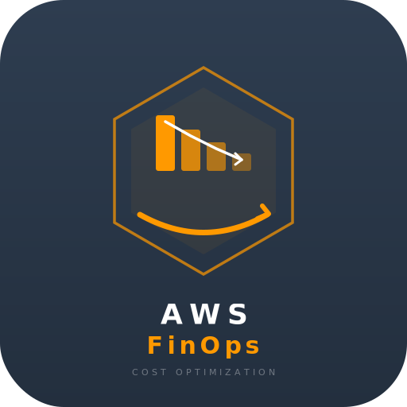

<br/><br/>

<!-- Hero Banner -->


<br/>

<picture>
  <source media="(prefers-color-scheme: dark)" srcset="https://img.shields.io/badge/Go-1.26+-00ADD8?style=for-the-badge&logo=go&logoColor=white" />
  
</picture>


<br/><br/>

# AWSFinOps Worker

<p>
  <strong>
    <samp>基于 Go 语言构建的 AWS 云成本优化定时任务引擎</samp>
  </strong>
</p>

<p>
  <samp>自动执行预算检查 · 成本分析 · 用量预测 · 规格优化建议<br/>支持多平台广播通知与报告归档</samp>
</p>

<br/>

<a href="docs/index.html">
  
</a>

<sub>带 CSS 样式、滚动动画、侧边导航的沉浸式阅读体验</sub>

</div>

<br/>

---

<br/>

<!-- ============================================================ -->
<!--                         TABLE OF CONTENTS                      -->
<!-- ============================================================ -->

<details open>
<summary>
  <h2>
    
  </h2>
</summary>

<br/>

<table>
<tr>
<td width="50%" valign="top">

**核心概念**

&nbsp;&nbsp;&nbsp;&nbsp;[项目概述](#-项目概述)
&nbsp;&nbsp;&nbsp;&nbsp;[系统架构](#-系统架构)
&nbsp;&nbsp;&nbsp;&nbsp;[核心流程](#-核心流程)
&nbsp;&nbsp;&nbsp;&nbsp;[配置加载机制](#-配置加载机制)

</td>
<td width="50%" valign="top">

**功能模块**

&nbsp;&nbsp;&nbsp;&nbsp;[报告导出与归档](#-报告导出与归档)
&nbsp;&nbsp;&nbsp;&nbsp;[多平台广播](#-多平台广播)
&nbsp;&nbsp;&nbsp;&nbsp;[目录结构](#-目录结构)

</td>
</tr>
<tr>
<td width="50%" valign="top">

**使用指南**

&nbsp;&nbsp;&nbsp;&nbsp;[快速开始](#-快速开始)
&nbsp;&nbsp;&nbsp;&nbsp;[环境变量](#-环境变量)
&nbsp;&nbsp;&nbsp;&nbsp;[本地开发](#-本地开发)

</td>
<td width="50%" valign="top">

**部署与参考**

&nbsp;&nbsp;&nbsp;&nbsp;[部署架构](#-部署架构)
&nbsp;&nbsp;&nbsp;&nbsp;[技术栈](#-技术栈)
&nbsp;&nbsp;&nbsp;&nbsp;[许可证](#-许可证)

</td>
</tr>
</table>

</details>

<br/>

---

<br/>

<!-- ============================================================ -->
<!--                        PROJECT OVERVIEW                        -->
<!-- ============================================================ -->

<h2>
  
</h2>

AWSFinOps Worker 是一个**无状态的定时任务工作器**，设计目标是在 AWS Lambda 中由 EventBridge 按计划触发（默认每 6 小时），自动完成一整套云成本治理流程。

### 核心特性

<table>
<thead>
<tr>
<th align="center" width="200">特性</th>
<th>说明</th>
</tr>
</thead>
<tbody>
<tr>
<td align="center"><strong>7 步流水线</strong></td>
<td>预算检查 → 成本查询 → 成本预测 → 用量对比 → 规格优化 → 综合分析 → 广播通知</td>
</tr>
<tr>
<td align="center"><strong>多环境支持</strong></td>
<td>本地循环模式（模拟 EventBridge）+ AWS Lambda 模式</td>
</tr>
<tr>
<td align="center"><strong>3 种报告格式</strong></td>
<td>PDF（高管，带水印）/ JSON（开发者）/ CSV（财务）</td>
</tr>
<tr>
<td align="center"><strong>7 种广播平台</strong></td>
<td>企业微信 / 飞书 / 钉钉 / Email / Slack / Telegram / Discord</td>
</tr>
<tr>
<td align="center"><strong>S3 Glacier 归档</strong></td>
<td>旧报告自动归档到 Glacier 存储，成本极低</td>
</tr>
<tr>
<td align="center"><strong>3 层配置加载</strong></td>
<td>S3 .env → Secrets Manager → 系统环境变量</td>
</tr>
<tr>
<td align="center"><strong>CloudWatch 结构化日志</strong></td>
<td>兼容 EMF 格式，便于监控与告警</td>
</tr>
</tbody>
</table>

<br/>

---

<br/>

<!-- ============================================================ -->
<!--                      SYSTEM ARCHITECTURE                       -->
<!-- ============================================================ -->

<h2>
  
</h2>

### 整体架构图

<div align="center">


</div>

### 模块依赖关系

<div align="center">


</div>

> **注**：`internal/aws` 包封装 AWS SDK 客户端，不反向依赖上层业务包，避免循环引用。

<br/>

---

<br/>

<!-- ============================================================ -->
<!--                        CORE PIPELINE                           -->
<!-- ============================================================ -->

<h2>
  
</h2>

### Worker 执行流水线

每次触发执行时，Worker 按顺序执行以下 7 个步骤。任一步骤失败不会中断后续步骤（容错设计），最终状态会根据所有步骤的结果综合判定。

<div align="center">


</div>

### 状态定义

<table>
<thead>
<tr>
<th align="center" width="220">状态</th>
<th width="240">说明</th>
<th>对最终状态的影响</th>
</tr>
</thead>
<tbody>
<tr>
<td align="center"><code>ok</code></td>
<td>步骤执行成功</td>
<td>正常</td>
</tr>
<tr>
<td align="center"><code>pending_implementation</code></td>
<td>功能待实现（占位步骤）</td>
<td>不影响，不计入失败</td>
</tr>
<tr>
<td align="center"><code>warn</code></td>
<td>有警告但不致命</td>
<td>最终状态可能为 <code>partial_failure</code></td>
</tr>
<tr>
<td align="center"><code>error</code></td>
<td>步骤执行失败</td>
<td>最终状态可能为 <code>error</code></td>
</tr>
<tr>
<td align="center"><code>skipped</code></td>
<td>配置关闭，主动跳过</td>
<td>不影响</td>
</tr>
</tbody>
</table>

<br/>

---

<br/>

<!-- ============================================================ -->
<!--                     CONFIG LOADING                             -->
<!-- ============================================================ -->

<h2>
  
</h2>

### 三层配置加载序列图

<div align="center">

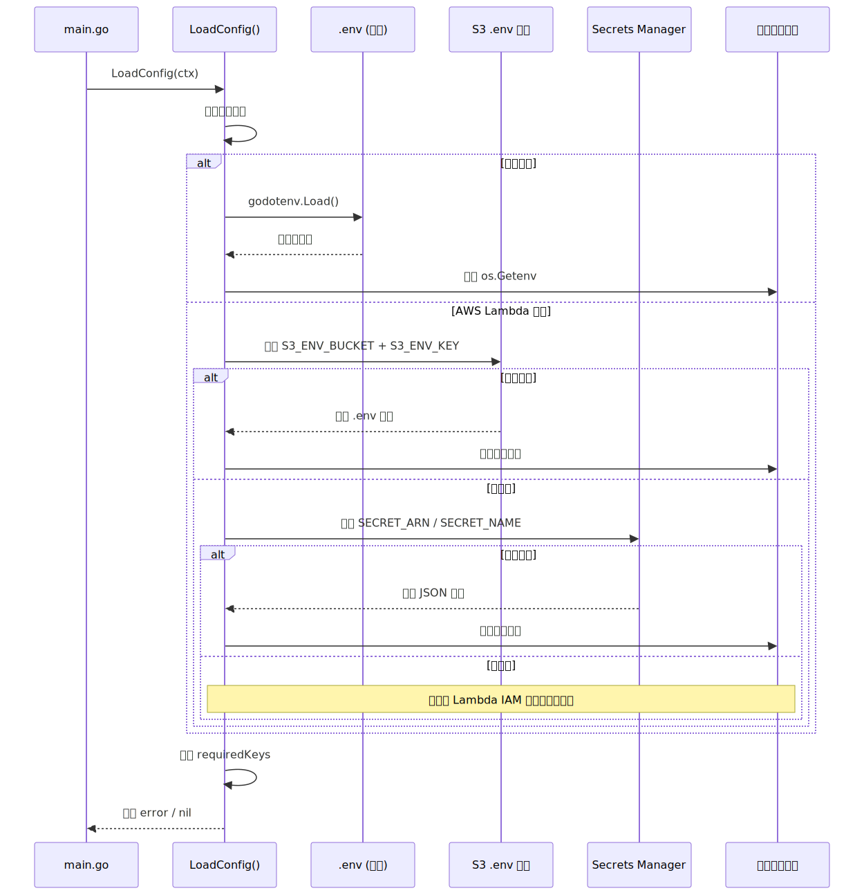

</div>

### 优先级规则

<div align="center">


</div>

> [!IMPORTANT] > **核心原则**：已存在于进程环境中的变量（如 Lambda IAM 注入的凭证）优先级最高，不会被 S3 或 Secrets Manager 覆盖。这保证了生产环境的安全性。

<br/>

---

<br/>

<!-- ============================================================ -->
<!--                    REPORT EXPORT & ARCHIVE                     -->
<!-- ============================================================ -->

<h2>
  
</h2>

### 报告处理流程

<div align="center">


</div>

### PDF 报告结构

<div align="center">


</div>

### 报告格式对比

<table>
<thead>
<tr>
<th align="center" width="100">格式</th>
<th align="center" width="160">受众</th>
<th align="center" width="100">文件大小</th>
<th>特点</th>
</tr>
</thead>
<tbody>
<tr>
<td align="center"><strong>PDF</strong></td>
<td align="center">高管 / 管理层</td>
<td align="center">~20 KB</td>
<td>精美排版、品牌水印、彩色表格</td>
</tr>
<tr>
<td align="center"><strong>JSON</strong></td>
<td align="center">开发者 / API 集成</td>
<td align="center">~2 KB</td>
<td>结构化、schema_version、RFC3339 时间戳</td>
</tr>
<tr>
<td align="center"><strong>CSV</strong></td>
<td align="center">财务 / 数据分析</td>
<td align="center">~1 KB</td>
<td>Excel 兼容（UTF-8 BOM）、双段布局</td>
</tr>
</tbody>
</table>

### S3 Glacier 归档策略

<table>
<thead>
<tr>
<th align="center" width="200">存储类型</th>
<th align="center" width="120">最低存储时长</th>
<th align="center" width="100">取回费用</th>
<th>适用场景</th>
</tr>
</thead>
<tbody>
<tr>
<td align="center"><code>GLACIER_IR</code>（默认）</td>
<td align="center">90 天</td>
<td align="center">低</td>
<td>历史报告快速检索</td>
</tr>
<tr>
<td align="center"><code>GLACIER</code></td>
<td align="center">90 天</td>
<td align="center">中</td>
<td>长期归档（分钟级取回）</td>
</tr>
<tr>
<td align="center"><code>DEEP_ARCHIVE</code></td>
<td align="center">180 天</td>
<td align="center">高</td>
<td>合规归档（小时级取回）</td>
</tr>
<tr>
<td align="center"><code>STANDARD_IA</code></td>
<td align="center">30 天</td>
<td align="center">最低</td>
<td>不常访问但需即时取回</td>
</tr>
</tbody>
</table>

<br/>

---

<br/>

<!-- ============================================================ -->
<!--                     MULTI-PLATFORM BROADCAST                   -->
<!-- ============================================================ -->

<h2>
  
</h2>

### 广播架构

<div align="center">


</div>

### 平台启用检测规则

每个平台都有对应的**启用条件**——至少配置了该平台的核心凭证才会被视为"已启用"：

<div align="center">


</div>

### 容错设计

> [!NOTE]
>
> - **单平台失败不影响其他平台**：任意平台发送失败只记录 WARN，其他平台继续发送
> - **总开关控制**：`BROADCAST_ENABLED=false` 可一键关闭所有广播
> - **空平台跳过**：未配置任何平台时，静默跳过，不报错

<br/>

---

<br/>

<!-- ============================================================ -->
<!--                     DIRECTORY STRUCTURE                         -->
<!-- ============================================================ -->

<h2>
  
</h2>

```
AWSFinOps/
├── main.go                      # 程序入口（本地循环 + Lambda 双模式）
├── main_test.go                 # 入口函数单元测试
├── go.mod                       # Go 模块定义
├── go.sum
├── .env.example                 # 环境变量示例
├── .gitignore
├── README.md                    # 项目文档（本文件）
│
├── internal/
│   ├── config.go                # 三层配置加载器
│   │
│   ├── worker/
│   │   └── engine.go            # Worker 核心引擎（7 步流水线）
│   │
│   ├── archive/
│   │   └── s3.go                # S3 Glacier 归档服务
│   │
│   ├── aws/                     # AWS SDK 封装层
│   │   ├── lambda.go            # Lambda 事件处理器
│   │   ├── costexplorer.go      # Cost Explorer 数据模型
│   │   ├── rightsizing.go       # 规格优化数据模型
│   │   ├── budget.go            # Budgets API 封装
│   │   ├── billing.go           # 计费共享类型
│   │   ├── ec2.go               # EC2 API 封装
│   │   ├── ecs.go               # ECS API 封装
│   │   └── s3.go                # S3 空壳（归档见 archive 包）
│   │
│   ├── billing/                 # 业务逻辑层
│   │   ├── budget.go            # BudgetState（线程安全预算状态）
│   │   ├── budget_management.go # 预算管理数据模型
│   │   └── analysis.go          # 成本分析报告
│   │
│   ├── services/                # 外部服务集成
│   │   ├── broadcast.go         # 多平台广播服务
│   │   └── handler.go           # 空壳（历史遗留）
│   │
│   └── utilities/               # 通用工具
│       ├── logger.go            # 结构化日志（CloudWatch EMF）
│       ├── document.go          # PDF/JSON/CSV 报告生成
│       ├── aws.go               # AWS 环境检测工具
│       └── fonts/
│           └── NotoSansSC-Regular.ttf  # PDF 中文字体
│
├── test/                        # 集成测试
│   ├── handler_test.go          # Worker 引擎测试
│   ├── server_test.go           # 配置与报告测试
│   ├── budget_test.go           # BudgetState 测试
│   ├── broadcast_test.go        # 广播服务测试
│   ├── config_test.go           # 配置加载测试
│   └── reports/                 # 测试生成的报告
│
└── reports/                     # 运行时生成的报告（默认目录）
```

<br/>

---

<br/>

<!-- ============================================================ -->
<!--                       QUICK START                              -->
<!-- ============================================================ -->

<h2>
  
</h2>

### 前置条件

|      依赖      | 要求                       |
| :------------: | :------------------------- |
|     **Go**     | 1.26+                      |
|  **AWS 凭证**  | Access Key / IAM Role      |
| **广播 Token** | （可选）各平台的 Bot Token |

### 安装与运行

```bash
# 1. 克隆仓库
git clone <repo-url>
cd AWSFinOps

# 2. 配置环境变量
cp .env.example .env
# 编辑 .env，填入 AWS 凭证和所需配置

# 3. 安装依赖
go mod download

# 4. 执行一次（调试模式）
WORKER_ONCE=true go run .

# 5. 循环模式（模拟 EventBridge，每 6 小时一次）
go run .
```

### 运行示例输出

<details>
<summary><strong>点击展开 JSON 输出示例</strong></summary>

<br/>

```json
{
  "timestamp": "2026-06-30T21:57:35+08:00",
  "level": "INFO",
  "app": "AWSFinOps",
  "component": "FinOpsWorker",
  "operation": "Run",
  "status": "success",
  "elapsed": "1.234ms",
  "message": "Worker 执行完成",
  "extra": {
    "run_id": "finops-20260630-215735-abc123",
    "status": "partial_failure",
    "steps": "7"
  }
}
```

</details>

<br/>

---

<br/>

<!-- ============================================================ -->
<!--                     ENVIRONMENT VARIABLES                      -->
<!-- ============================================================ -->

<h2>
  
</h2>

<details open>
<summary><strong>基础配置</strong></summary>

<br/>

| 变量名                  |   默认值    | 说明                          |
| :---------------------- | :---------: | :---------------------------- |
| `AWS_REGION`            | `ap-east-1` | AWS 区域                      |
| `AWS_ACCESS_KEY_ID`     |      -      | **必填** AWS Access Key       |
| `AWS_SECRET_ACCESS_KEY` |      -      | **必填** AWS Secret Key       |
| `AWS_ACCOUNT_ID`        |      -      | AWS 账号 ID（PDF 水印，大写） |

</details>

<details>
<summary><strong>Worker 配置</strong></summary>

<br/>

| 变量名            | 默认值  | 说明                                          |
| :---------------- | :-----: | :-------------------------------------------- |
| `WORKER_INTERVAL` |  `6h`   | 本地模式循环间隔（支持 `30s`/`5m`/`6h` 格式） |
| `WORKER_ONCE`     | `false` | `true` = 执行一次后退出                       |
| `IS_AWS`          |    -    | 强制指定是否在 AWS 环境运行                   |

</details>

<details>
<summary><strong>报告导出配置</strong></summary>

<br/>

| 变量名              |   默认值    | 说明             |
| :------------------ | :---------: | :--------------- |
| `EXPORT_REPORT`     |   `true`    | 是否启用报告导出 |
| `REPORT_OUTPUT_DIR` | `./reports` | 报告输出目录     |
| `EXPORT_PDF`        |   `true`    | 是否导出 PDF     |
| `EXPORT_JSON`       |   `true`    | 是否导出 JSON    |
| `EXPORT_CSV`        |   `true`    | 是否导出 CSV     |

</details>

<details>
<summary><strong>S3 Glacier 归档配置</strong></summary>

<br/>

| 变量名                     |      默认值       | 说明                                 |
| :------------------------- | :---------------: | :----------------------------------- |
| `S3_ARCHIVE_BUCKET`        |         -         | S3 Bucket 名称（不配置则不启用归档） |
| `S3_ARCHIVE_REGION`        |    `ap-east-1`    | Bucket 所在区域                      |
| `S3_ARCHIVE_STORAGE_CLASS` |   `GLACIER_IR`    | 存储类型                             |
| `S3_ARCHIVE_PREFIX`        | `finops-reports/` | 对象前缀                             |

</details>

<details>
<summary><strong>广播配置</strong></summary>

<br/>

| 变量名               | 默认值 | 说明                       |
| :------------------- | :----: | :------------------------- |
| `BROADCAST_ENABLED`  | `true` | 广播总开关                 |
| `TELEGRAM_BOT_TOKEN` |   -    | Telegram Bot Token         |
| `TELEGRAM_CHAT_ID`   |   -    | Telegram Chat ID           |
| `WEIXIN_BOT_TOKEN`   |   -    | 企业微信机器人 Token       |
| `WEIXIN_CHAT_ID`     |   -    | 企业微信 Chat ID           |
| `FEISHU_BOT_TOKEN`   |   -    | 飞书机器人 Token           |
| `FEISHU_CHAT_ID`     |   -    | 飞书 Chat ID               |
| `DINGTALK_BOT_TOKEN` |   -    | 钉钉机器人 Token           |
| `DINGTALK_SECRET`    |   -    | 钉钉签名密钥               |
| `SMTP_HOST`          |   -    | SMTP 服务器地址            |
| `SMTP_PORT`          | `587`  | SMTP 端口                  |
| `SMTP_USERNAME`      |   -    | SMTP 用户名                |
| `SMTP_PASSWORD`      |   -    | SMTP 密码                  |
| `SMTP_FROM`          |   -    | 发件人地址（默认同用户名） |
| `SMTP_TO`            |   -    | 收件人地址                 |
| `SLACK_BOT_TOKEN`    |   -    | Slack Bot Token            |
| `SLACK_CHANNEL_ID`   |   -    | Slack Channel ID           |
| `DISCORD_BOT_TOKEN`  |   -    | Discord Webhook URL        |
| `DISCORD_CHANNEL_ID` |   -    | Discord Channel ID         |

</details>

<details>
<summary><strong>S3 / Secrets Manager 配置</strong></summary>

<br/>

| 变量名          | 默认值 | 说明                             |
| :-------------- | :----: | :------------------------------- |
| `S3_ENV_BUCKET` |   -    | S3 .env 文件所在 Bucket          |
| `S3_ENV_KEY`    |   -    | S3 .env 文件 Key                 |
| `SECRET_ARN`    |   -    | Secrets Manager 密钥 ARN（优先） |
| `SECRET_NAME`   |   -    | Secrets Manager 密钥名称         |

</details>

<br/>

---

<br/>

<!-- ============================================================ -->
<!--                      LOCAL DEVELOPMENT                         -->
<!-- ============================================================ -->

<h2>
  
</h2>

### 运行测试

```bash
# 运行所有测试
go test ./...

# 运行指定包测试
go test -v ./test/

# 查看覆盖率
go test -cover ./...
```

### 代码规范

本项目遵循以下代码规范（详见 `.trae/rules/`）：

| 规范         | 文件                                                       |
| :----------- | :--------------------------------------------------------- |
| **代码格式** | [code-format.md](.trae/rules/code-format.md)               |
| **提交规范** | [git-commit-message.md](.trae/rules/git-commit-message.md) |
| **技能基准** | [skills_rule.md](.trae/rules/skills_rule.md)               |

### 快速验证清单

> [!TIP]
> 开发新功能后，请确认以下各项全部通过：

- [ ] `go build ./...` 编译通过
- [ ] `go vet ./...` 无警告
- [ ] `go test ./...` 所有测试通过
- [ ] 日志消息均为中文
- [ ] 错误使用 `fmt.Errorf("描述: %w", err)` 包装
- [ ] 数据库操作使用 `WithContext(ctx)`

<br/>

---

<br/>

<!-- ============================================================ -->
<!--                    DEPLOYMENT ARCHITECTURE                     -->
<!-- ============================================================ -->

<h2>
  
</h2>

### AWS 部署拓扑

<div align="center">


</div>

### IAM 权限策略

Lambda 执行角色所需的最小权限：

<details>
<summary><strong>点击展开 IAM Policy JSON</strong></summary>

<br/>

```json
{
  "Version": "2012-10-17",
  "Statement": [
    {
      "Effect": "Allow",
      "Action": [
        "ce:GetCostAndUsage",
        "ce:GetCostForecast",
        "ce:GetRightsizingRecommendation"
      ],
      "Resource": "*"
    },
    {
      "Effect": "Allow",
      "Action": [
        "s3:GetObject",
        "s3:PutObject",
        "s3:CreateBucket",
        "s3:PutBucketEncryption",
        "s3:PutPublicAccessBlock"
      ],
      "Resource": [
        "arn:aws:s3:::your-config-bucket/*",
        "arn:aws:s3:::your-archive-bucket/*"
      ]
    },
    {
      "Effect": "Allow",
      "Action": ["secretsmanager:GetSecretValue"],
      "Resource": "arn:aws:secretsmanager:region:account:secret:your-secret-*"
    },
    {
      "Effect": "Allow",
      "Action": [
        "logs:CreateLogGroup",
        "logs:CreateLogStream",
        "logs:PutLogEvents"
      ],
      "Resource": "arn:aws:logs:region:account:*"
    }
  ]
}
```

</details>

<br/>

---

<br/>

<!-- ============================================================ -->
<!--                        TECH STACK                              -->
<!-- ============================================================ -->

<h2>
  
</h2>

<table>
<thead>
<tr>
<th align="center" width="100">类别</th>
<th align="center" width="200">技术</th>
<th align="center" width="80">版本</th>
<th>用途</th>
</tr>
</thead>
<tbody>
<tr>
<td align="center"></td>
<td align="center">Go</td>
<td align="center">1.26+</td>
<td>主编程语言</td>
</tr>
<tr>
<td align="center"></td>
<td align="center">aws-sdk-go-v2</td>
<td align="center">v1.x</td>
<td>AWS 服务集成</td>
</tr>
<tr>
<td align="center"></td>
<td align="center">go-pdf/fpdf</td>
<td align="center">v0.9.0</td>
<td>PDF 报告生成</td>
</tr>
<tr>
<td align="center"></td>
<td align="center">godotenv</td>
<td align="center">-</td>
<td>.env 文件解析</td>
</tr>
<tr>
<td align="center"></td>
<td align="center">自研（CloudWatch EMF）</td>
<td align="center">-</td>
<td>结构化日志</td>
</tr>
<tr>
<td align="center"></td>
<td align="center">Noto Sans SC</td>
<td align="center">-</td>
<td>PDF 中文字体</td>
</tr>
<tr>
<td align="center"></td>
<td align="center">AWS Lambda</td>
<td align="center">-</td>
<td>无服务器运行时</td>
</tr>
<tr>
<td align="center"></td>
<td align="center">EventBridge</td>
<td align="center">-</td>
<td>定时调度</td>
</tr>
<tr>
<td align="center"></td>
<td align="center">S3 Glacier</td>
<td align="center">-</td>
<td>历史报告归档</td>
</tr>
</tbody>
</table>

<br/>

---

<br/>

<!-- ============================================================ -->
<!--                         LICENSE                                -->
<!-- ============================================================ -->

<h2>
  
</h2>

本项目采用 [MIT License](LICENSE) 开源协议。

<br/>

---

<br/>

<!-- ============================================================ -->
<!--                         SUPPORT                                -->
<!-- ============================================================ -->

<div align="center">

<h2>支持</h2>

<p>如果您觉得本项目对您有帮助，欢迎请我喝杯咖啡</p>
<p><sub>您的支持是我持续维护和改进的动力</sub></p>

<br/>

<strong>微信扫码捐赠</strong><br/><br/>


<br/><br/>

---

<br/>

<samp>

**AWSFinOps Worker**

基于 Go 构建 · 安全设计 · [ctkqiang](https://github.com/ctkqiang)

<br/>


</samp>

</div>
